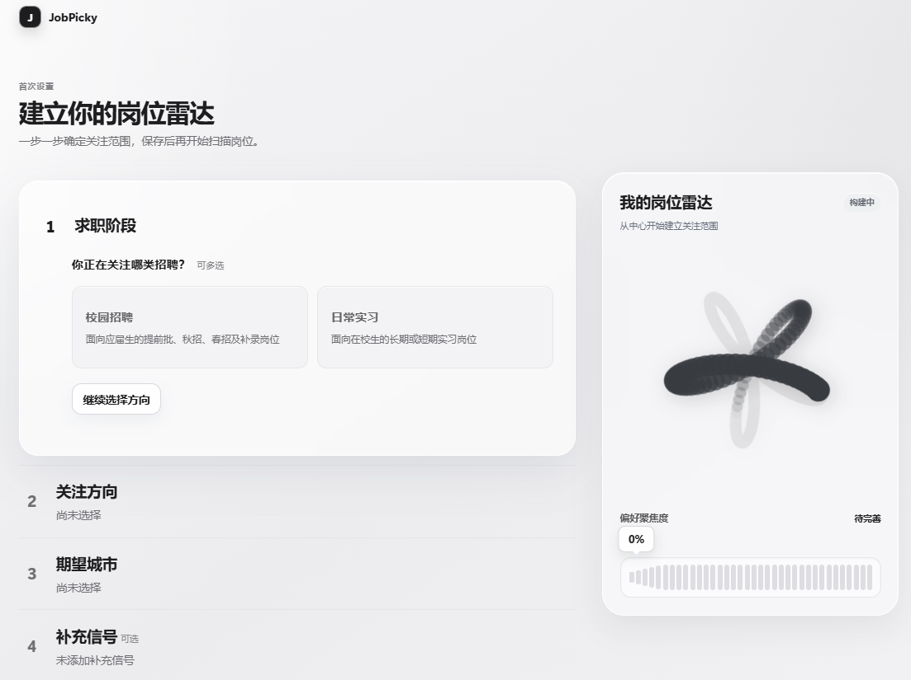
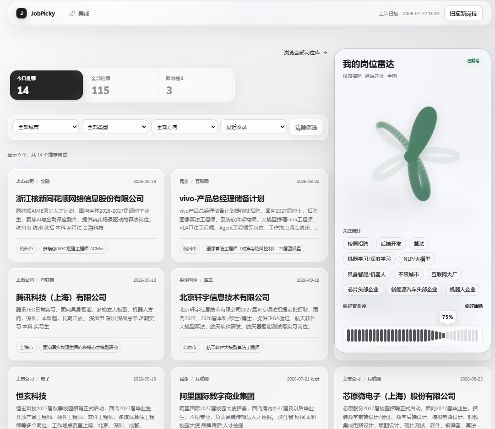
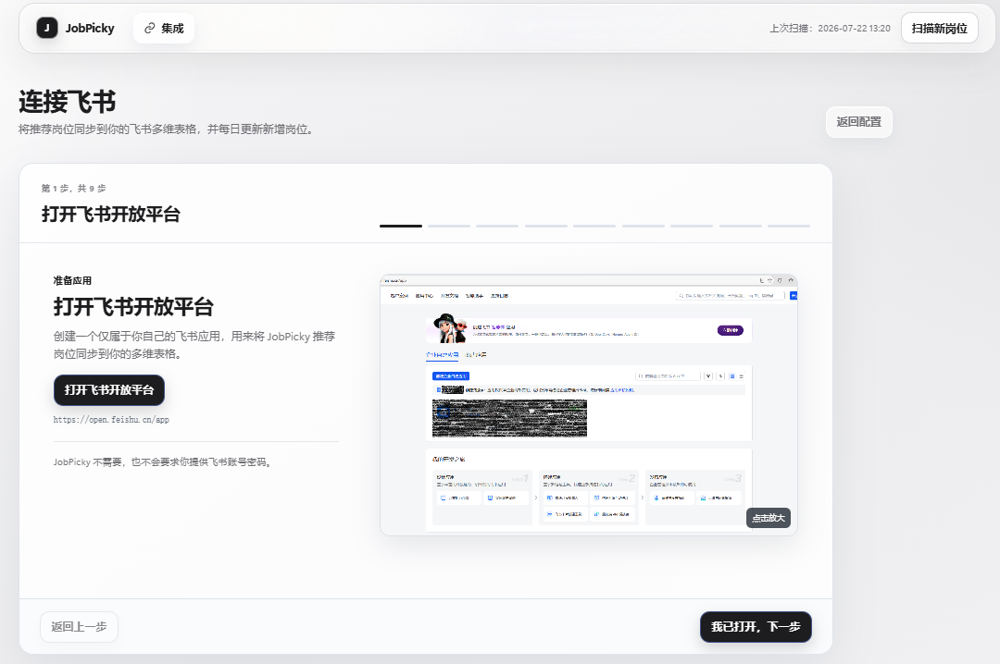
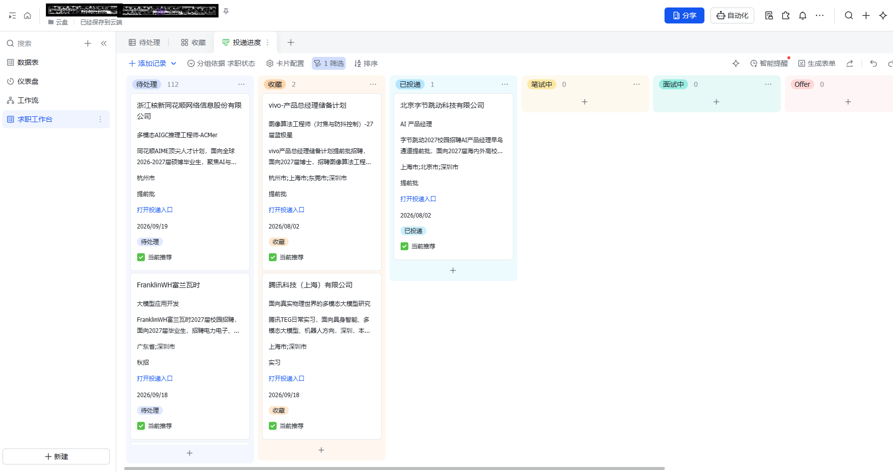

# JobPicky

本地运行的个性化岗位雷达：把分散的招聘公告整理成清晰的岗位清单，只把更符合你偏好的机会放到面前。

[](https://github.com/mushang0/JobPicky/actions/workflows/tests.yml)
[](https://www.python.org/)
[](LICENSE)


## 它解决什么问题

求职时，真正耗时的往往不是打开招聘网站，而是反复做这些事：

- 在大量招聘公告里筛选校招、实习和目标方向；
- 处理公司、岗位、地点和截止时间不统一的问题；
- 每次扫描新机会，都重新从头筛选一遍。

JobPicky 把岗位发现和筛选收拢到一个本地工作台里：

1. 选择招聘批次、岗位方向、城市和关键词；
2. 扫描并整理新的招聘公告；
3. 按你的偏好匹配岗位，展示推荐理由和官方投递入口；
4. 在岗位列表中搜索、筛选、分页和查看详情；
5. 需要维护求职状态时，连接飞书后使用自动创建的求职工作台。

它不是自动投递工具，也不替你做最终判断；它负责减少重复筛选和信息整理。

## 快速开始

要求 Python 3.11 或更高版本。普通用户无需配置数据库或 YAML 文件。

### 使用 uv（推荐）

已安装 [uv](https://docs.astral.sh/uv/) 时：

```powershell
uvx --python 3.12 jobpicky
```

### 没有 uv

直接使用 Python 的 pip 安装：

```powershell
python -m pip install jobpicky
jobpicky
```

启动后会自动打开本地 WebUI。第一次使用时：

1. 在“偏好设置”中选择招聘批次、岗位方向、城市和关键词；
2. 点击“扫描新岗位”，等待岗位雷达完成更新；
3. 在推荐视图中查看匹配岗位，打开详情确认招聘公告和投递链接。





## 飞书同步（可选）

飞书不是必需项。不连接飞书，也可以完成岗位扫描、匹配、筛选和详情查看。

在 WebUI 的“集成”页面，按 9 步图文向导完成首次配置：

1. 在[飞书开放平台](https://open.feishu.cn/app)创建企业自建应用；
2. 开通应用身份的多维表格权限 `bitable:app`；
3. 发布应用版本；
4. 创建或打开目标 Base；
5. 将 JobPicky 添加为文档应用，并授予“可管理”权限；
6. 粘贴包含 `/base/` 的 Base 链接；
7. 完成只读检查；
8. 确认写入范围；
9. 创建工作台并同步推荐岗位。

首次连接会自动创建或修复“求职工作台”，并同步当前推荐岗位。之后的扫描会更新对应记录，不会重复创建已经同步的岗位。岗位状态、备注和下一步行动目前需要在飞书工作台中维护，本地 WebUI 尚未提供这部分功能。





安全提醒：JobPicky 不需要飞书账号密码。App Secret 只用于连接飞书，并保存在本机配置中；不要把它发到 Issue、日志或聊天中。断开连接不会删除飞书中的工作台或已有岗位，清除本地凭据前页面会再次确认。

## 当前状态与反馈

项目仍在持续开发中。当前版本优先解决岗位发现、个性化匹配和飞书同步；本地求职状态管理、备注和下一步行动还没有开发完成。

如果你遇到问题，或希望 JobPicky 支持某个招聘来源、筛选条件或工作流，欢迎在 [GitHub Issues](https://github.com/mushang0/JobPicky/issues) 提出需求。后续会根据实际需求和反馈持续迭代。

## 数据与隐私

- WebUI 的运行数据默认保存在 Windows 的 `%LOCALAPPDATA%\JobPicky\`。
- 岗位库、匹配结果和本地日志不会自动上传到 JobPicky 服务端。
- 新岗位扫描需要访问对应的招聘数据源；推荐结果会受到数据源内容和你的偏好设置影响。
- 飞书集成是可选的；只有在你主动连接后，推荐岗位才会同步到目标 Base。

## 开发文档

开发环境安装、CLI 维护命令、完整测试、UI 沙盒、发布验收和项目结构说明见 [DEVELOPER.md](DEVELOPER.md)。

## 许可证

[MIT](LICENSE)
